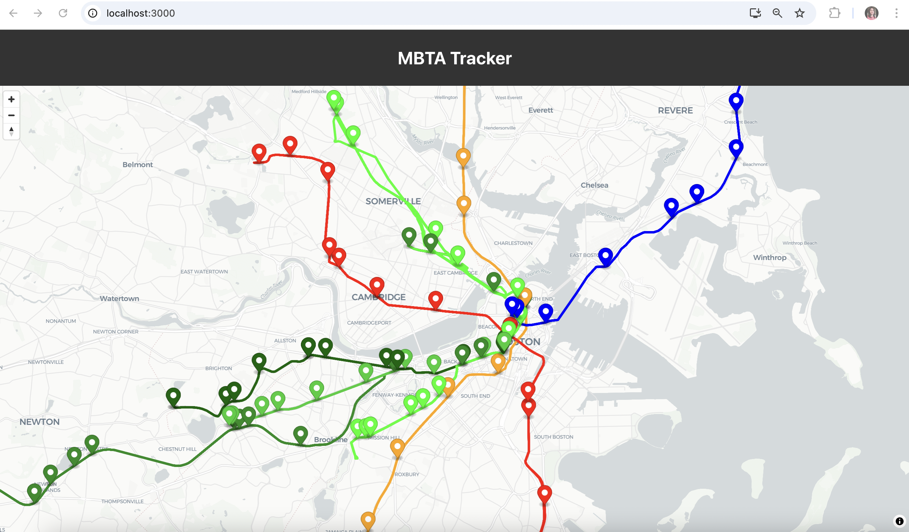
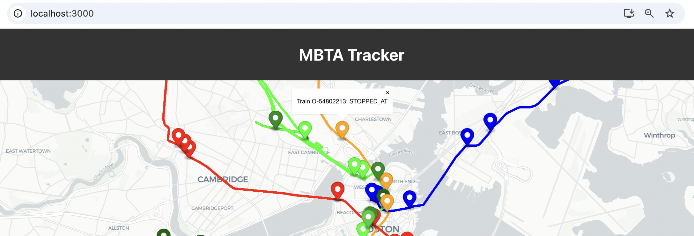
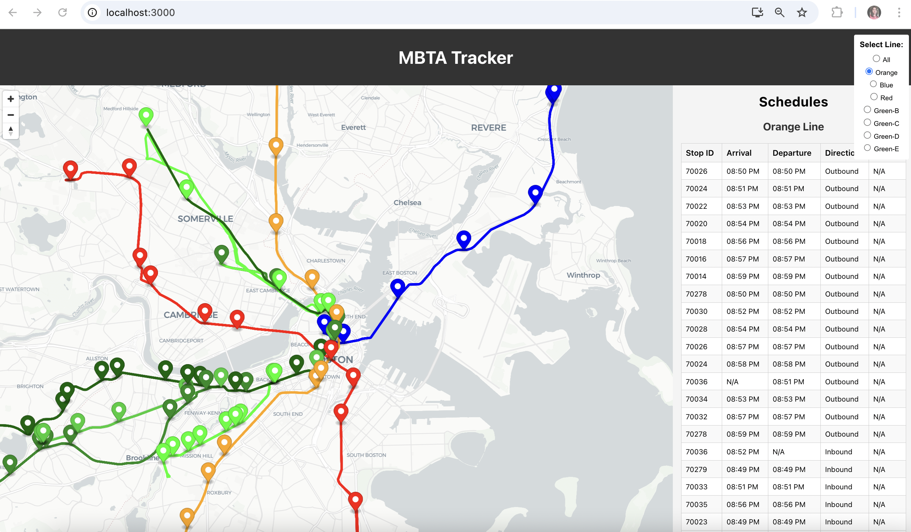

# hw-proposal

* The team lead's repo for this assignment will become the project repo for the team.
* An instructor will add project partners to the team lead's repo.
* Guidelines for your proposal.md and plan.md are here: [proposal-guidelines.md](./proposal-guidelines.md) 

<BR>
<BR>

# MBTA Live Tracker

<BR>

### App Overview

The MBTA Train Tracker is a React-based web application for tracking train routes, schedules, and live locations on a map using MapLibre GL JS. The app leverages the MBTA V3 API to fetch real-time data for trains, routes, and schedules, providing users with an intuitive interface to explore the Massachusetts Bay Transportation Authority's train network.

<br>

### Features 

Interactive Map: Displays MBTA train routes and real-time train positions using MapLibre GL JS.
<br>
Route Selection: Filter trains and schedules by individual train lines (e.g., Orange, Blue, Red, Green Lines).
<br>
Animated Train Movement: Train markers move smoothly across the map as new position data is fetched.
<br>
Schedules Sidebar: View upcoming train schedules (arrival/departure times, stop IDs, directions, and status) for each route.
<br>
Responsive Design: Fully responsive UI that works across various devices and screen sizes.
<br>

### Data Source 

This application uses the MBTA V3 API to fetch real-time and scheduled train data: 
<br>
Vehicles API: Provides real-time train locations and statuses. 
<br>
Endpoint: https://api-v3.mbta.com/vehicles 
<br>
<br>
Shapes API: Retrieves route shapes for train lines. 
<br>
Endpoint: https://api-v3.mbta.com/shapes 
<br>
<br>Schedules API: 
<br>
Fetches scheduled arrival and departure times for trains at each stop. 
<br>
Endpoint: https://api-v3.mbta.com/schedules

<br><br>

### Tech Used

React: JavaScript library for building user interfaces.
<BR>
MapLibre: Open-source mapping library for interactive maps and realtime data mapping.

### Dependencies to Install

MapLibre: For interactive map rendering, install with:

```
npm install maplibre-gl
```


### Start the App

Ensure all dependencies are installed by running:

```
cd mbta_realtimemap
```

```
npm install
```

Start the development server:

```
npm start
```
<BR>
<BR>
<BR>

### V0.1
This initial version focuses on developing a live map to display all MBTA trains
<BR>
The map contains the following :
<BR>
#### I Current train locations


#### II Train Routes

<UL>
<LI>
    Orange Line
</LI>
<LI>
    Blue Line
</LI>
<LI>    
    Red Line
</LI>
<LI>    
    Green-B
</LI>
<LI>    
    Green-C
</LI>
<LI>    
    Green-D
</LI>
<LI>    
    Green-E
</LI>    
</UL>

#### III Train Status



### V0.2
The next version focuses on making the map interactive by displaying each train's details by clicking on the marker.
It also includes creating a sidebar which is used to display the schedule of each line's upcoming trains
<BR>
The web application contains the following :
<BR>

#### I Train Details

<UL>
<LI>
    Train ID
</LI>
<LI>
    Train Status
</LI>  
</UL>



<BR>

#### II Train Schedules




### V0.3
The final version shows live map displaying movements of each line's train along the route using MapLibre's animation frames.
New train locations are fetched every ten seconds by calling the fetch function using React's setinterval property. This updated data is handled using MapLibre ability to handle asynchronous API calls
<BR>

[](https://github.com/nuwebdev/project-fall24-CristalWilsonLobo/blob/main/mbta_realtimemap/Images/v0_3.mov)